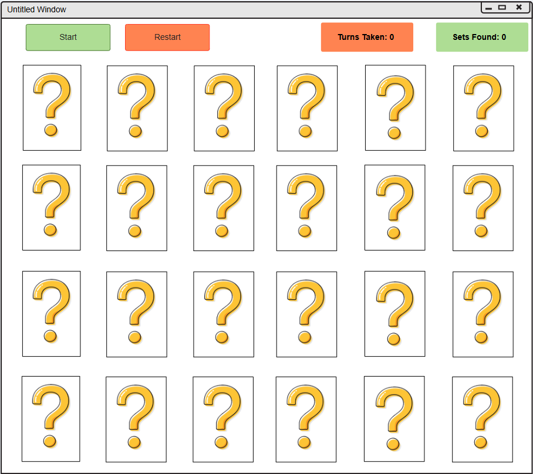

# Memory Game

## Overview
This document describes requirements for the software implementation of the classic memory game.  The game can only be played by a single player. A description of the game and plus the requirements of its implementation are provided bellow.

## The Game
The game is presented by a 5x3 grid of 16 cards; every card has a question mark on one side and a picture on the other side the game will allow a player to turn over a card and try to find its matching card with the same picture - one set at a time. With every set found the 2 cards of that set are removed from the board. The game counts the Moves taken and the sets found and displays them at the toolbar on top, when the Moves taken and sets found are apart with more than 5 the player is out. 

**The full spec for this software is [Memory-gmae-spec.md](docs/Memory-gmae-spec.md) in the docs folder.**

